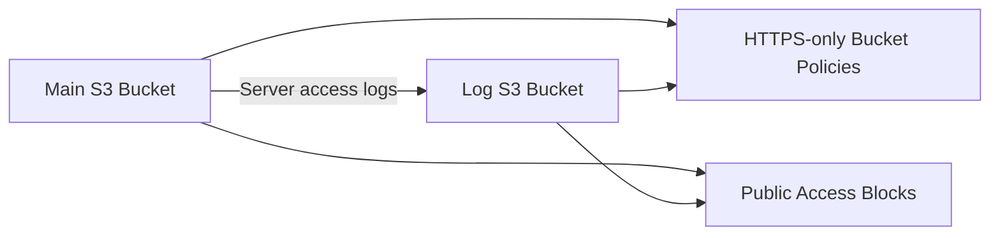

# 01 - AWS S3 Basics with Terraform

AWS S3 lab built with Terraform for private buckets, access logs, and HTTPS-only bucket policies.

## Architecture

This diagram shows the main S3 bucket, the log bucket, and the shared security controls.



## Resources

- Main bucket: `01-s3-basics`
- Log bucket: `01-s3-basics-logs`
- Server access logging from main bucket to log bucket
- HTTPS-only bucket policies on both buckets
- Explicit public access blocks on both buckets

## What I learned

- How to create S3 buckets with Terraform
- How to reuse one bucket policy pattern with `for_each`
- Why the log bucket should not log to itself
- Why public S3 access should usually stay blocked

## Run

```sh
../../tools/tf.sh plan
../../tools/tf.sh apply
../../tools/tf.sh destroy
```
