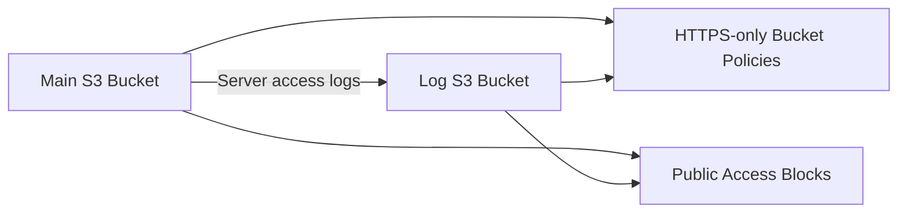

# 01 - S3 Basics

Private S3 bucket lab for Floci.

## Architecture



## Resources

- Main bucket: `01-s3-basics`
- Log bucket: `01-s3-basics-logs`
- Server access logging from main bucket to log bucket
- HTTPS-only bucket policies on both buckets
- Explicit S3 public access blocks on both buckets
- Terraform outputs for the main bucket

## What I learned

- How to create S3 buckets with Terraform
- How Terraform references resources
- How to use bucket policies with `jsonencode`
- How to apply the same policy pattern to multiple buckets with `for_each`
- Why the log bucket should not log to itself
- Why public S3 access should usually be blocked

## Commands

Run from this project directory:

```sh
../../tools/tf.sh plan
../../tools/tf.sh apply
../../tools/tf.sh destroy
```
