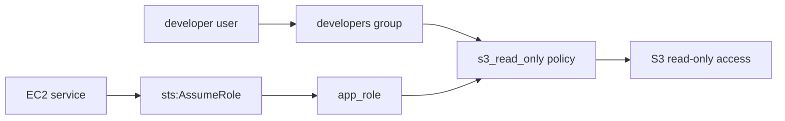

# 02 - AWS IAM Basics with Terraform

AWS IAM lab built with Terraform for users, groups, policies, roles, and S3 access.

## Architecture

This diagram shows the human access path and the EC2 role access path to the same S3 policy.



## Resources

- S3 bucket: `02-iam-basics`
- HTTPS-only bucket policy and public access block
- IAM user: `developer`
- IAM group: `developers`
- Custom read-only S3 policy
- IAM role: `app-role-02-iam-basics`
- Trust policy for EC2

## Permission paths

```text
developer user -> developers group -> s3_read_only policy -> S3 read-only access
EC2 service -> sts:AssumeRole -> app_role -> s3_read_only policy -> S3 read-only access
```

## What I learned

- How a user inherits permissions through a group
- How trust policies differ from permission policies
- How one policy can be reused for both humans and workloads
- Why `sts:AssumeRole` gives workloads temporary credentials

## Run

```sh
../../tools/tf.sh plan
../../tools/tf.sh apply
../../tools/tf.sh destroy
```
