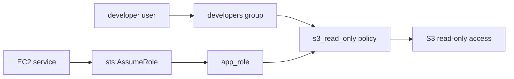

# 02 - IAM Basics

Basic IAM identities and permissions lab for Floci.

This is a learning-in-public lab. It mirrors real IAM building blocks, but Floci behavior can differ from AWS.

## Resources

- S3 bucket: `02-iam-basics`
- HTTPS-only bucket policy and explicit S3 public access block
- IAM user: `developer`
- IAM group: `developers`
- User group membership from `developer` to `developers`
- Custom IAM policy: `s3-read-only-02-iam-basics`
- Group policy attachment from `developers` to the S3 read-only policy
- IAM role: `app-role-02-iam-basics`
- Trust policy allowing the EC2 service to assume the role
- Role policy attachment from `app-role-02-iam-basics` to the S3 read-only policy
- Terraform outputs for the IAM identities

## Architecture



## Permission paths

Human access path:

```text
developer user -> developers group -> s3_read_only policy -> S3 read-only access
```

Workload access path:

```text
EC2 service -> sts:AssumeRole -> app_role -> s3_read_only policy -> S3 read-only access
```

## What I learned

- How to create IAM users and groups with Terraform
- How a user can inherit permissions through a group
- How to create a custom IAM policy with `jsonencode`
- How trust policies control who can assume a role
- How `sts:AssumeRole` gives a workload temporary credentials
- How to reuse one permissions policy for both humans and workloads

## Floci note

The permission model is the same shape as AWS, but this repo is for learning and local experimentation, not production guidance.

## Commands

Run from this project directory:

```sh
../../tools/tf.sh plan
../../tools/tf.sh apply
../../tools/tf.sh destroy
```
