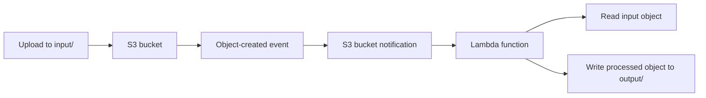

# 03 - Lambda S3

Event-driven S3 to Lambda lab for Floci.

This is a learning-in-public lab. The Terraform models a real AWS event flow, but Floci can behave differently from AWS.

## Resources

- S3 bucket: `03-lambda-s3`
- HTTPS-only bucket policy and explicit S3 public access block
- IAM role: `lambda-role-03-lambda-s3`
- Custom IAM policy: `s3-access-03-lambda-s3`
- IAM policy attachment from the Lambda role to the S3 access policy
- Lambda function: `s3-processor-03-lambda-s3`
- Lambda deployment package created from `app/index.js`
- Lambda permission allowing S3 to invoke the function
- S3 bucket notification for object creation under `input/`
- Terraform outputs for the main resources

## Architecture



## Event flow

```text
Upload file to S3 input/
-> S3 object-created event
-> S3 bucket notification
-> Lambda function invoke
-> Lambda reads the input object
-> Lambda writes a processed object to output/
```

## Permission paths

S3 invoking Lambda:

```text
S3 bucket -> aws_lambda_permission -> Lambda function
```

Lambda accessing S3:

```text
Lambda function -> Lambda execution role -> s3_access policy -> S3 input/output prefixes
```

Allowed object access:

```text
s3:GetObject on input/*
s3:PutObject on output/*
```

## What I learned

- How to package Lambda code with the `archive` provider
- How to create a Lambda function and execution role with Terraform
- How `aws_lambda_permission` controls who can invoke the function
- How `aws_s3_bucket_notification` connects S3 events to Lambda
- How to scope the flow to `input/` and `output/` prefixes
- How to verify an end-to-end event-driven path locally

## Test

Run from this project directory:

```sh
../../tools/tf.sh plan
../../tools/tf.sh apply
```

Upload a test file:

```sh
echo "hello lambda" > /tmp/hello.txt
aws s3 cp /tmp/hello.txt s3://03-lambda-s3/input/hello.txt
```

Check the processed output:

```sh
aws s3 ls s3://03-lambda-s3/output/
aws s3 cp s3://03-lambda-s3/output/hello.txt -
```

Expected output:

```text
Processed by Lambda:
hello lambda
```

Check the S3 notification configuration:

```sh
aws s3api get-bucket-notification-configuration \
  --bucket 03-lambda-s3
```

## Commands

Run from this project directory:

```sh
../../tools/tf.sh plan
../../tools/tf.sh apply
../../tools/tf.sh destroy
```

If destroy fails because the bucket is not empty:

```sh
aws s3 rm s3://03-lambda-s3 --recursive
../../tools/tf.sh destroy
```

## Floci note

This lab follows the real AWS pattern, but Floci behavior can differ from AWS.

Important distinction:

```text
aws_lambda_permission controls who can invoke the Lambda function.
The Lambda execution role controls what the Lambda function can do after it starts running.
```
