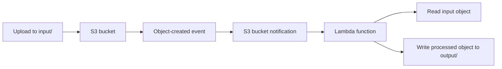

# 03 - AWS Lambda and S3 with Terraform

AWS Lambda and S3 lab built with Terraform where S3 object creation triggers a Lambda function.

## Architecture

This diagram shows the S3 event flow from `input/` uploads to Lambda processing and `output/` writes.



## Resources

- S3 bucket: `03-lambda-s3`
- HTTPS-only bucket policy and public access block
- IAM role: `lambda-role-03-lambda-s3`
- Custom S3 access policy for the Lambda
- Lambda function: `s3-processor-03-lambda-s3`
- Lambda permission allowing S3 invoke
- S3 notification for object creation under `input/`

## Permission path

```text
S3 bucket -> aws_lambda_permission -> Lambda function
Lambda function -> execution role -> s3_access policy -> S3 input/output prefixes
```

## What I learned

- How to package Lambda code with the `archive` provider
- How `aws_lambda_permission` and the execution role solve different problems
- How to scope the flow to `input/` and `output/`
- How to verify an event-driven path end to end

## Run

```sh
../../tools/tf.sh plan
../../tools/tf.sh apply
../../tools/tf.sh destroy
```

## Verify

Upload a file:

```sh
echo "hello lambda" > /tmp/hello.txt
aws s3 cp /tmp/hello.txt s3://03-lambda-s3/input/hello.txt
```

Check the result:

```sh
aws s3 cp s3://03-lambda-s3/output/hello.txt -
```

Expected:

```text
Processed by Lambda:
hello lambda
```
