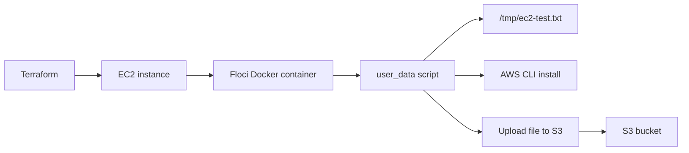

# 04 - EC2 Basics

EC2 instance with an IAM role writes a file to S3 during boot.

## Architecture



## Resources

- S3 bucket: `04-ec2-basics`
- HTTPS-only bucket policy and public access block
- IAM role: `ec2-role-04-ec2-basics`
- Custom S3 write policy
- IAM instance profile: `ec2-profile-04-ec2-basics`
- EC2 instance with external `user_data`

## Permission path

```text
EC2 instance -> instance profile -> EC2 role -> s3_access policy -> S3 bucket
```

## What I learned

- How `user_data` bootstraps work at instance start
- Why EC2 needs an instance profile, not just a role
- How to keep bootstrap logic in a separate script with `templatefile`
- How to verify Floci EC2 behavior through the backing container

## Run

```sh
../../tools/tf.sh plan
../../tools/tf.sh apply
../../tools/tf.sh destroy
```

## Verify

Check the uploaded file:

```sh
aws s3 cp s3://04-ec2-basics/ec2-test.txt -
```

Expected:

```text
hello from ec2
```
