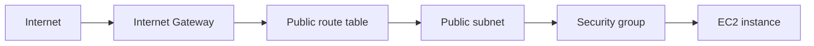

# 05 - VPC Basics

Basic public VPC networking lab for Floci.

This is a learning-in-public networking lab. It uses Floci locally, so network behavior can differ from real AWS.

## Resources

- VPC: `05-vpc-basics`
- Public subnet: `05-vpc-basics-public`
- Internet Gateway and public route table
- Route table association from the public subnet to the public route table
- Security group: `05-vpc-basics-web-sg`
- EC2 instance with a public IP
- Inline `user_data` script starting a small HTTP server
- Terraform outputs for the network and EC2 instance

## Architecture



## Network flow

```text
Internet
-> Internet Gateway
-> Public route table
-> Public subnet
-> Security Group
-> EC2 instance
```

## Public subnet path

```text
VPC 10.0.0.0/16
-> Public subnet 10.0.1.0/24
-> Route table association
-> Public route table
-> 0.0.0.0/0 route
-> Internet Gateway
```

This means the subnet has a route for internet traffic.

## Security group rules

```text
Inbound:
tcp/80 from 0.0.0.0/0

Outbound:
all protocols to 0.0.0.0/0
```

This means the EC2 instance can receive HTTP traffic on port 80 and make outbound connections.

## Boot flow

```text
Terraform creates EC2 instance
-> Floci starts a Docker container for the instance
-> user_data runs inside the container
-> script creates /tmp/index.html
-> script starts a Python HTTP server on port 80
```

## What I learned

- How a subnet becomes public when it has a route to an Internet Gateway
- How a route table association connects a subnet to its route table
- How a security group controls inbound and outbound traffic for an instance
- How a public IP changes reachability for an EC2 instance
- How Floci can model AWS networking concepts even when underlying container networking differs

## Test

Run from this project directory:

```sh
../../tools/tf.sh plan
../../tools/tf.sh apply
```

Check the EC2 instance:

```sh
aws ec2 describe-instances \
  --query "Reservations[].Instances[].{InstanceId:InstanceId,PublicIp:PublicIpAddress,PrivateIp:PrivateIpAddress,State:State.Name}"
```

Check that the EC2 container is running:

```sh
docker ps --format "table {{.Names}}\t{{.Ports}}\t{{.Status}}"
```

Check the HTTP server from inside the container:

```sh
docker exec -it <container-name> bash
cat /tmp/index.html
curl http://127.0.0.1:80
```

Expected output:

```text
hello from 05-vpc-basics
```

## Commands

Run from this project directory:

```sh
../../tools/tf.sh plan
../../tools/tf.sh apply
../../tools/tf.sh destroy
```

## Floci note

Floci models the AWS networking shape, but instance private IPs and host reachability can differ because EC2 runs as local Docker containers.

For example, real AWS private IPs would come from the subnet CIDR, while Floci may show Docker-style addresses instead.
