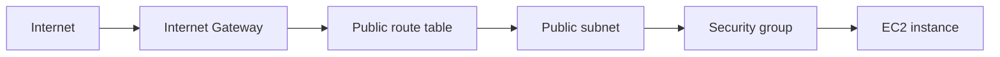

# 05 - AWS VPC Basics with Terraform

AWS VPC lab built with Terraform for a public subnet, route tables, an internet gateway, and one EC2 web server.

## Architecture

This diagram shows the public-network path from the internet to the EC2 instance.



## Resources

- VPC: `05-vpc-basics`
- Public subnet: `05-vpc-basics-public`
- Internet Gateway and public route table
- Route table association
- Security group: `05-vpc-basics-web-sg`
- EC2 instance with a public IP
- Inline `user_data` starting a Python HTTP server

## Network path

```text
Internet -> Internet Gateway -> route table -> public subnet -> security group -> EC2
```

## What I learned

- A subnet becomes public when it has a route to an Internet Gateway
- Route table associations matter just as much as the route itself
- Security groups define reachability separately from subnet design
- Floci can model the network shape well even if container networking differs from AWS

## Run

```sh
../../tools/tf.sh plan
../../tools/tf.sh apply
../../tools/tf.sh destroy
```

## Verify

From inside the EC2 container:

```sh
curl http://127.0.0.1:80
```

Expected:

```text
hello from 05-vpc-basics
```
