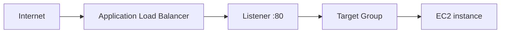

# 06 - AWS ALB and EC2 with Terraform

AWS Application Load Balancer and EC2 lab built with Terraform for a single HTTP backend.

## Architecture

This diagram shows the request path from the Application Load Balancer listener to the EC2 target.



## Resources

- VPC: `10.0.0.0/16`
- Two public subnets
- Internet Gateway and public route table
- ALB security group
- EC2 security group
- Application Load Balancer
- Target group and listener
- EC2 instance running a Python HTTP server

The backend responds with:

```text
hello from 06-alb-ec2-basics
```

## Security groups

```text
0.0.0.0/0 -> ALB tcp/80
ALB security group -> EC2 tcp/80
```

## What I learned

- How listeners, target groups, and target registration fit together
- How one security group can reference another
- Why a backend can stay off the public internet and still receive traffic
- Why local Floci validation is still useful even when host reachability differs from AWS

## Run

```sh
../../tools/tf.sh init
../../tools/tf.sh validate
../../tools/tf.sh plan
../../tools/tf.sh apply
../../tools/tf.sh destroy
```

## Verify

Inside the EC2 container:

```sh
docker exec -it <ec2-container-name> curl http://127.0.0.1:80
```

Expected:

```text
hello from 06-alb-ec2-basics
```
