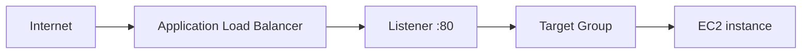

# 06 - ALB EC2 Basics

Basic ALB to EC2 flow for Floci.

This is a learning-in-public lab. It is meant to show how the pieces connect, not to present a production-ready ALB design, and Floci behavior can differ from real AWS.

## Resources

- VPC: `10.0.0.0/16`
- Public subnet A: `10.0.1.0/24`
- Public subnet B: `10.0.2.0/24`
- Internet Gateway and public route table
- Route table associations for both public subnets
- ALB security group
- EC2 security group
- Application Load Balancer
- Target group and target group attachment
- HTTP listener on port `80`
- EC2 instance running a small Python HTTP server

## Architecture



The EC2 instance serves:

```text
hello from 06-alb-ec2-basics
```

## Security groups

ALB security group:

```text
0.0.0.0/0 -> TCP 80
```

EC2 security group:

```text
ALB security group -> TCP 80
```

The EC2 instance is placed in a public subnet but does not get a public IP. That works for this lab because traffic is meant to come through the ALB. In a more typical production design, backend instances would usually sit in private subnets behind the ALB.

## Key concepts

- The ALB is the public entry point for HTTP traffic.
- The listener defines which port and protocol the ALB accepts.
- The target group defines where the ALB forwards requests.
- The target group attachment registers the EC2 instance as a backend target.
- The EC2 instance can stay off the public internet and still receive traffic through the ALB.

## Terraform flow

```text
VPC
  -> Public subnets
  -> Internet Gateway
  -> Route table
  -> Security groups
  -> ALB
  -> Target group
  -> EC2 instance
  -> Target group attachment
  -> Listener
```

## What I learned

- Why a public ALB usually spans at least two subnets
- How security groups can reference other security groups
- How the listener, target group, and target attachment depend on each other
- Why an instance can be reachable through an ALB without having its own public IP
- Why local Floci validation of the resource graph is useful even when end-to-end reachability differs from AWS

## Commands

Run from this project directory:

```sh
../../tools/tf.sh init
../../tools/tf.sh fmt
../../tools/tf.sh validate
../../tools/tf.sh plan
../../tools/tf.sh apply
```

Destroy the lab:

```sh
../../tools/tf.sh destroy
```

## Useful AWS CLI checks

```sh
aws elbv2 describe-load-balancers --no-cli-pager
aws elbv2 describe-target-groups --no-cli-pager
aws ec2 describe-instances --no-cli-pager
```

Check listeners:

```sh
aws elbv2 describe-listeners \
  --load-balancer-arn "<alb-arn>" \
  --no-cli-pager
```

Check target health:

```sh
aws elbv2 describe-target-health \
  --target-group-arn "<target-group-arn>" \
  --no-cli-pager
```

## Local Floci note

Floci creates the ALB resources and the EC2 backend for this lab.

The EC2 web server responds inside the EC2 container:

```sh
docker exec -it <ec2-container-name> curl http://127.0.0.1:80
```

Expected response:

```text
hello from 06-alb-ec2-basics
```

The ALB DNS name is usually not reachable from the host on port `80` in this local setup. `*.localhost.floci.io:4566` reaches the Floci edge/API endpoint, not the ALB listener.

## Real AWS note

This lab uses HTTP on port `80` intentionally for local learning. In real AWS, a public ALB would normally use HTTPS with an ACM certificate.
