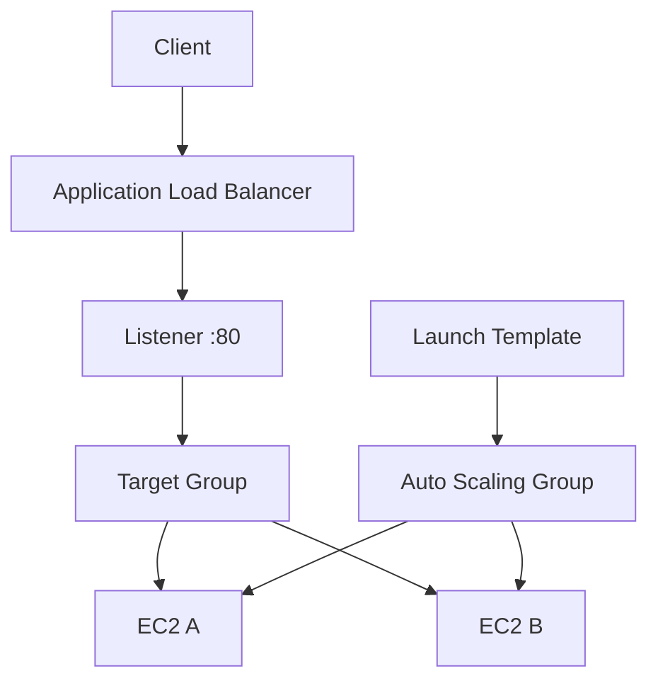

# 07 - AWS ALB and Auto Scaling with Terraform

AWS Application Load Balancer and EC2 Auto Scaling lab built with Terraform for two web instances behind one ALB.

## Architecture

This diagram shows the ALB request path and the Launch Template plus Auto Scaling Group that create the EC2 targets.



## Resources

- VPC: `10.0.0.0/16`
- Two public subnets
- Internet Gateway and public route table
- ALB security group
- EC2 security group
- Application Load Balancer
- Target group and HTTP listener
- Launch Template
- Auto Scaling Group
- Two EC2 instances running a Python HTTP server

The instances respond with:

```text
hello from 07-alb-autoscaling
```

## Auto Scaling setup

```text
min: 2
desired: 2
max: 4
```

The Auto Scaling Group registers instances in the target group, so no manual target attachment is needed.

## What I learned

- How a Launch Template replaces hand-made `aws_instance` resources
- How the Auto Scaling Group and target group wire together directly
- Why `health_check_type = "ELB"` matters here
- Why Launch Template changes do not replace running instances by themselves
- When instance recreation or refresh is needed to pick up new user data

## Run

```sh
../../tools/tf.sh init
../../tools/tf.sh validate
../../tools/tf.sh plan
../../tools/tf.sh apply
../../tools/tf.sh destroy
```

## Verify

Check target health:

```sh
aws elbv2 describe-target-health   --target-group-arn "<target-group-arn>"   --no-cli-pager
```

Check one EC2 container:

```sh
docker exec -it <ec2-container-name> curl http://127.0.0.1:80
```

Expected:

```text
healthy
hello from 07-alb-autoscaling
```
