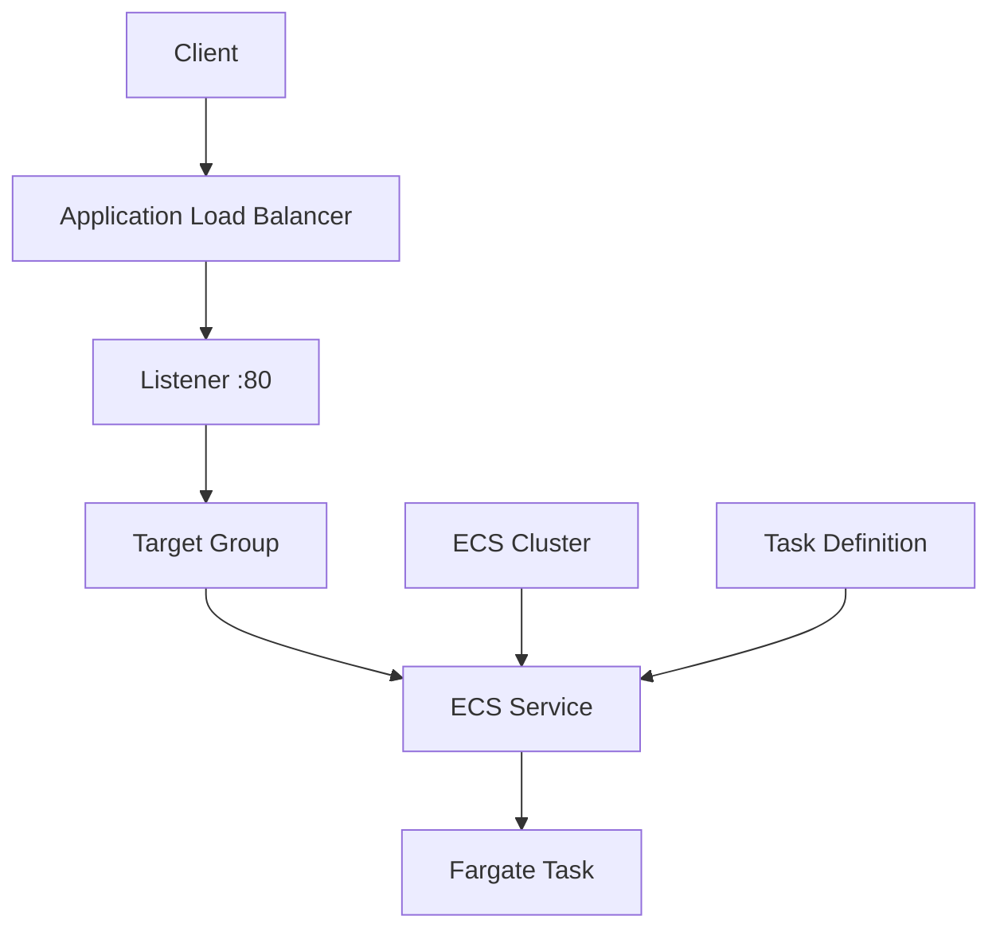

# 08 - AWS ECS Fargate and ALB with Terraform

AWS ECS Fargate lab built with Terraform for a service behind an Application Load Balancer.

## Architecture

This diagram shows the request path from the ALB to the ECS service and Fargate task.



## Resources

- VPC: `10.0.0.0/16`
- Two public subnets
- Internet Gateway and public route table
- ALB security group
- Fargate task security group
- Application Load Balancer
- Target group and HTTP listener
- ECS Cluster
- ECS Task Definition
- ECS Service
- IAM execution role
- One Fargate task running `nginx:alpine`

The container responds with:

```text
Welcome to nginx!
```

## Notes

- The ECS service uses `launch_type = FARGATE` and `network_mode = awsvpc`.
- The target group uses `target_type = "ip"` because Fargate tasks register by IP.
- In this local setup, Floci exposes container port `80` on the host, so this lab stays at one task.

## What I learned

- Why Fargate needs `awsvpc`
- Why Fargate target groups use IP targets instead of instance targets
- How ECS Service keeps the desired task count alive
- Where the execution role matters vs the security group

## Run

```sh
../../tools/tf.sh init
../../tools/tf.sh validate
../../tools/tf.sh plan
../../tools/tf.sh apply
../../tools/tf.sh destroy
```

## Verify

Open the app:

```text
http://localhost
```

Check target health:

```sh
aws elbv2 describe-target-health   --target-group-arn "<target-group-arn>"   --no-cli-pager
```

Expected:

```text
Welcome to nginx!
healthy
```
