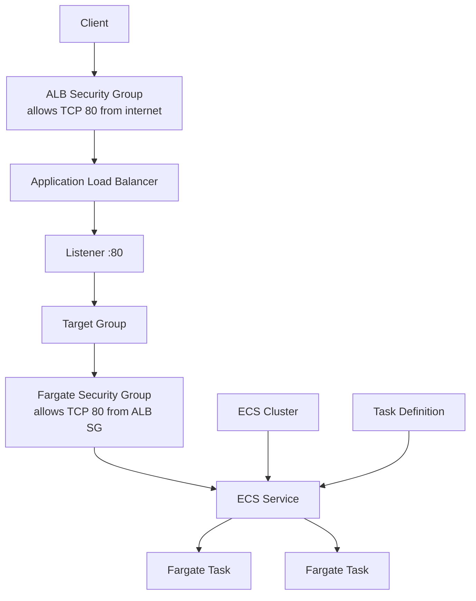
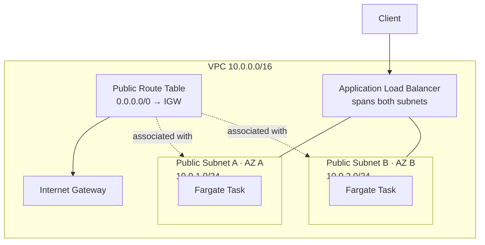

# 08 - ECS Fargate ALB

Basic ECS Fargate deployment behind an Application Load Balancer using Terraform and Floci.

This is a learning-in-public lab. It is meant to show how ECS, Fargate, networking, IAM, and ALB connect together, not to present a production-ready container platform, and Floci behavior can differ from real AWS.

## Architecture

### Request flow



### Network placement



## Resources

- VPC: `10.0.0.0/16`
- Public subnet A: `10.0.1.0/24`
- Public subnet B: `10.0.2.0/24`
- Internet Gateway and public route table
- Route table associations for both public subnets
- ALB security group
- Fargate task security group
- Application Load Balancer
- Target group
- HTTP listener on port `80`
- ECS Cluster
- ECS Task Definition
- ECS Service
- IAM execution role
- One Fargate task running `nginx:alpine`

The container serves:

```text
Welcome to nginx!
```

## Security groups

ALB security group:

```text
0.0.0.0/0 -> TCP 80
```

Fargate task security group:

```text
ALB security group -> TCP 80
```

The Fargate task only accepts HTTP traffic from the ALB security group.

## ECS configuration

The ECS Service uses:

```text
launch type: FARGATE
network mode: awsvpc
desired tasks: 1
```

The Task Definition defines:

- Container image
- CPU
- Memory
- Container port
- Network mode
- Execution role

The ECS Service launches tasks in the configured subnets and automatically registers them in the target group.

The target group forwards traffic only to healthy tasks.

## Key concepts

- An ECS Cluster is a logical grouping of services and tasks.
- A Task Definition describes how a container should run.
- A Service maintains the desired number of running tasks.
- Fargate runs containers without managing EC2 instances.
- Each Fargate task receives its own network interface when using `awsvpc`.
- Fargate tasks register themselves in the target group using their IP address.
- The target group therefore uses `target_type = "ip"` instead of `instance`.
- The execution role allows ECS to pull container images and send logs on behalf of the task.
- The task security group controls network traffic, while the IAM execution role controls AWS API access.

## What I learned

- How ECS, Services, Tasks, and Task Definitions relate to each other
- How Fargate removes the need to manage EC2 instances
- Why `awsvpc` networking is required for Fargate
- Why Fargate target groups use `target_type = "ip"`
- How an ECS Service automatically registers tasks in the target group
- How ALB health checks determine which tasks receive traffic
- The difference between security groups and IAM roles
- The purpose of the ECS Task Execution Role
- Why ECS Services maintain the desired number of running tasks

## Commands

Run from this project directory:

```sh
../../tools/tf.sh init
../../tools/tf.sh fmt
../../tools/tf.sh validate
../../tools/tf.sh plan
../../tools/tf.sh apply
```

Apply without confirmation:

```sh
../../tools/tf.sh apply-auto
```

Destroy the lab:

```sh
../../tools/tf.sh destroy
```

## Useful AWS CLI checks

List ECS clusters:

```sh
aws ecs list-clusters \
  --no-cli-pager
```

Describe the ECS service:

```sh
aws ecs describe-services \
  --cluster <cluster-name> \
  --services <service-name> \
  --no-cli-pager
```

List running tasks:

```sh
aws ecs list-tasks \
  --cluster <cluster-name> \
  --desired-status RUNNING \
  --no-cli-pager
```

List task definitions:

```sh
aws ecs list-task-definitions \
  --no-cli-pager
```

List load balancers:

```sh
aws elbv2 describe-load-balancers \
  --no-cli-pager
```

Check target health:

```sh
aws elbv2 describe-target-health \
  --target-group-arn "<target-group-arn>" \
  --no-cli-pager
```

Expected target state:

```text
healthy
```

## Local Floci verification

List running containers:

```sh
docker ps
```

Open the web server:

```text
http://localhost
```

Expected response:

```text
Welcome to nginx!
```

The running task should appear as healthy:

```text
healthy
```

## Local Floci note

Floci creates the ECS Cluster, ECS Service, Fargate task, ALB, and target registrations for this lab.

Floci currently exposes container port `80` directly on the Docker host.

Because of this limitation, only one Fargate task can run locally when using port `80`.

In real AWS, each Fargate task receives its own ENI and private IP address, so multiple tasks can listen on the same container port without conflict.

## Real AWS note

This lab uses public subnets and HTTP on port `80` to keep the local setup simple.

In a more typical production design:

- The ALB would use HTTPS with an ACM certificate.
- ECS tasks would usually run in private subnets.
- NAT Gateways would provide outbound internet access.
- The ECS Service would run multiple tasks across multiple Availability Zones.
- Auto Scaling policies would adjust the desired task count based on metrics such as CPU utilization or request count.
- Container images would typically be stored in Amazon ECR.
- CloudWatch Logs would collect application logs automatically.
