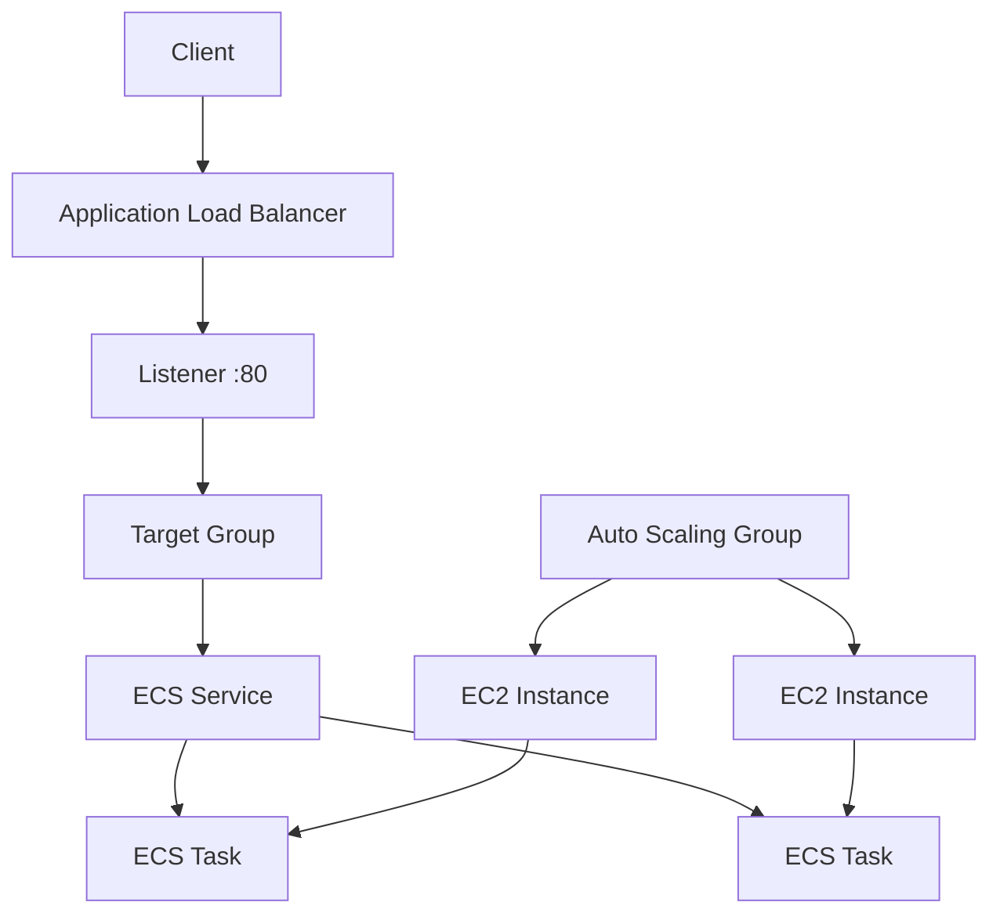

# 09 - AWS ECS on EC2 and ALB with Terraform

AWS ECS on EC2 lab built with Terraform for an ECS service behind an Application Load Balancer.

## Architecture

This diagram shows the ALB request path, the ECS service, and the EC2 capacity behind the cluster.



## Resources

- VPC: `10.0.0.0/16`
- Two public subnets
- Internet Gateway and public route table
- ALB security group
- ECS task security group
- Application Load Balancer
- Target group and HTTP listener
- ECS Cluster
- ECS Task Definition
- ECS Service
- Launch Template
- Auto Scaling Group
- IAM execution role
- IAM role and instance profile for ECS container instances
- Two ECS tasks running `nginx:alpine`

The tasks respond with:

```text
Welcome to nginx!
```

## Notes

- The ECS service uses `launch_type = EC2` with `network_mode = awsvpc`.
- EC2 instances join the ECS cluster through ECS agent config in `user_data`.
- The target group still uses `target_type = "ip"` because ECS tasks register by IP, not by instance ID.

## What I learned

- The difference between ECS on EC2 and ECS on Fargate
- How the Launch Template and Auto Scaling Group provide ECS capacity
- How ECS agent bootstrap in `user_data` connects instances to the cluster
- Why `awsvpc` tasks still use IP targets even on EC2

## Run

```sh
../../tools/tf.sh init
../../tools/tf.sh validate
../../tools/tf.sh plan
../../tools/tf.sh apply
../../tools/tf.sh destroy
```

## Verify

Open the ALB URL:

```text
http://<alb-dns-name>
```

Check target health:

```sh
aws elbv2 describe-target-health   --target-group-arn "<target-group-arn>"   --no-cli-pager
```

Expected:

```text
Welcome to nginx!
healthy
```
