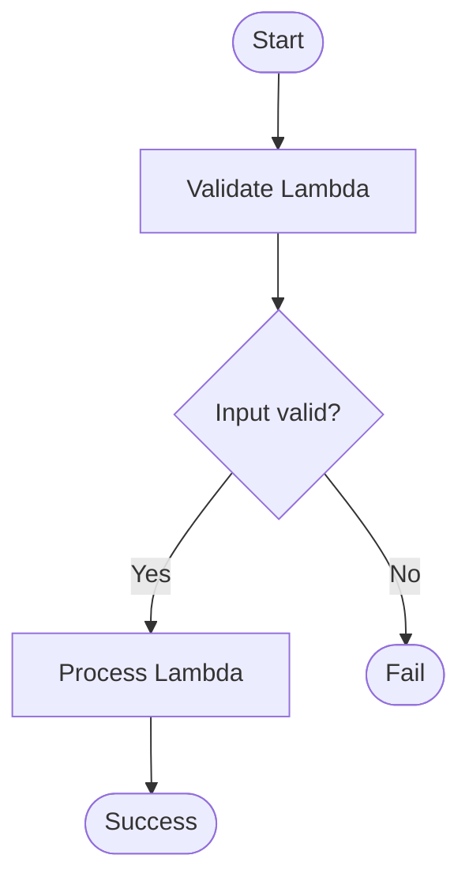
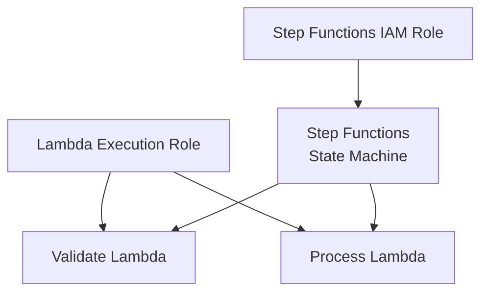

# 10 - Step Functions

Basic AWS Step Functions workflow using Lambda functions and Terraform with Floci.

This is a learning-in-public lab. It is meant to show how Step Functions orchestrate multiple Lambda functions into a workflow, not to present a production-ready serverless application, and Floci behavior can differ from real AWS.

## Architecture

### Workflow



### Resources



## Resources

- Lambda execution role
- Lambda execution role attachment (`AWSLambdaBasicExecutionRole`)
- Step Functions IAM role
- Step Functions IAM policy
- Step Functions IAM policy attachment
- Validate Lambda
- Process Lambda
- Step Functions State Machine

## IAM configuration

The Lambda execution role allows the Lambda functions to write logs to CloudWatch.

The Step Functions role allows the state machine to invoke the Lambda functions.

## Workflow configuration

The workflow starts in the `Validate` state.

If the input is valid:

```text
Validate
→ Process
→ Success
```

Otherwise:

```text
Validate
→ Fail
```

The workflow is implemented as a Step Functions state machine using Amazon States Language.

## Key concepts

- A State Machine defines an entire workflow.
- A State represents one step in the workflow.
- `StartAt` defines the first state.
- `Task` executes a resource such as a Lambda function.
- `Choice` evaluates the output of a previous state.
- `Next` defines which state executes next.
- `End` terminates a successful workflow.
- `Fail` terminates a failed workflow.
- Step Functions orchestrate workflows while Lambda functions contain the business logic.

## What I learned

- The difference between workflow orchestration and business logic.
- How Step Functions coordinate multiple Lambda functions.
- How a State Machine is built using Amazon States Language.
- How `Task`, `Choice`, `Fail`, and `End` states work.
- Why Step Functions make complex serverless workflows easier to maintain.
- How Step Functions use an IAM role to invoke Lambda functions.
- The difference between a Lambda execution role and a Step Functions execution role.

## Commands

Run from this project directory:

```sh
../../tools/tf.sh init
../../tools/tf.sh fmt
../../tools/tf.sh validate
../../tools/tf.sh plan
../../tools/tf.sh apply
```

Apply without confirmation:

```sh
../../tools/tf.sh apply-auto
```

Destroy the lab:

```sh
../../tools/tf.sh destroy
```

## Useful AWS CLI checks

Start a successful execution:

```sh
aws stepfunctions start-execution \
  --state-machine-arn <state-machine-arn> \
  --input '{"value":5}' \
  --no-cli-pager
```

Start a failed execution:

```sh
aws stepfunctions start-execution \
  --state-machine-arn <state-machine-arn> \
  --input '{"value":-1}' \
  --no-cli-pager
```

Describe an execution:

```sh
aws stepfunctions describe-execution \
  --execution-arn <execution-arn> \
  --no-cli-pager
```

## Local Floci verification

Successful execution:

```text
Input:
{ "value": 5 }

Status:
SUCCEEDED

Output:
{
  "originalValue": 5,
  "processedValue": 10,
  "message": "Value processed successfully"
}
```

Failed execution:

```text
Input:
{ "value": -1 }

Status:
FAILED

Error:
ValidationFailed

Cause:
Input value must be a positive number
```

This verifies the complete workflow:

```text
Input
→ Validate Lambda
→ Choice
→ Process Lambda
→ Success

or

Input
→ Validate Lambda
→ Choice
→ Fail
```

## Real AWS note

This lab uses two simple Lambda functions to demonstrate the fundamentals of Step Functions.

In a more typical production design:

- A workflow may contain many states.
- Workflows often orchestrate Lambda, ECS, Batch, Glue, SNS, SQS, DynamoDB, or other AWS services.
- Retry and Catch policies are commonly used to recover from transient failures.
- Parallel states can execute multiple branches simultaneously.
- Wait states can pause execution until a specific time or duration.
- CloudWatch Logs and X-Ray are commonly used to monitor executions.
- State Machines often coordinate long-running business processes rather than placing all logic inside a single Lambda function.