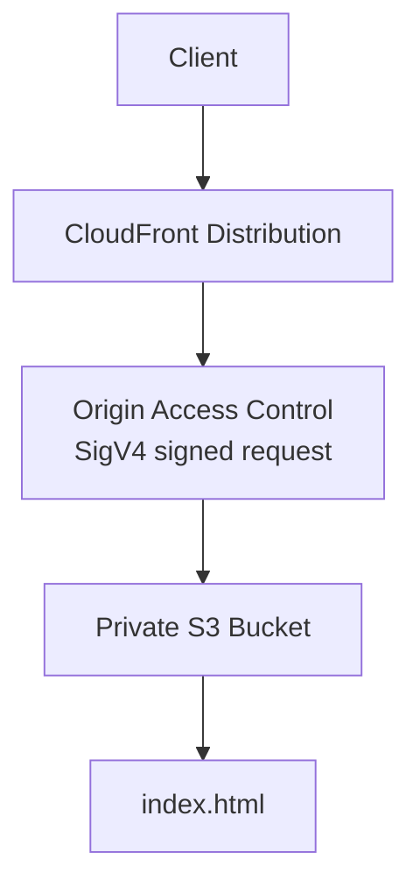

# 11 - AWS CloudFront and S3 OAC with Terraform

AWS CloudFront and S3 lab built with Terraform for a private S3 origin protected by Origin Access Control.

## Architecture

This diagram shows CloudFront fetching content from a private S3 bucket through Origin Access Control.



## Resources

- Private S3 bucket
- S3 Public Access Block
- HTTPS-only bucket policy
- Bucket policy allowing only this CloudFront distribution to read objects
- Origin Access Control (OAC)
- CloudFront distribution
- Static `index.html`

The page responds with:

```text
CloudFront works!
```

## What I learned

- How OAC keeps the S3 bucket private while still letting CloudFront fetch objects
- How the bucket policy can scope access to one CloudFront distribution ARN
- Why direct S3 access should fail while CloudFront still works
- Why this lab had to be checked in real AWS instead of local Floci

## Run

```sh
../../tools/tf.sh init
../../tools/tf.sh validate
../../tools/tf.sh plan
../../tools/tf.sh apply
../../tools/tf.sh destroy
```

## Verify

CloudFront should work:

```sh
curl https://<cloudfront-domain>
```

Direct S3 should fail:

```sh
curl https://<bucket>.s3.<region>.amazonaws.com/index.html
```

Expected:

```text
CloudFront works!
AccessDenied
```
