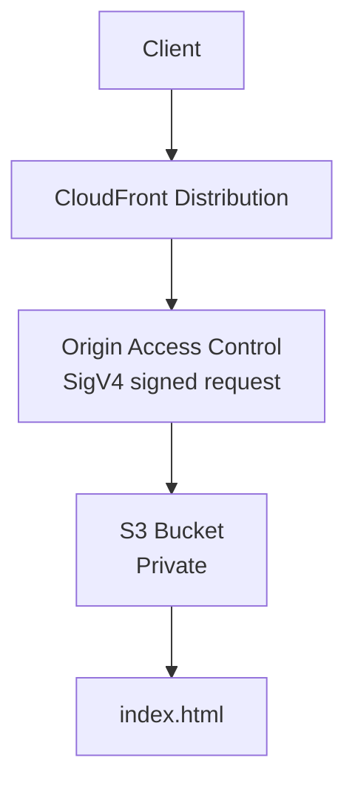
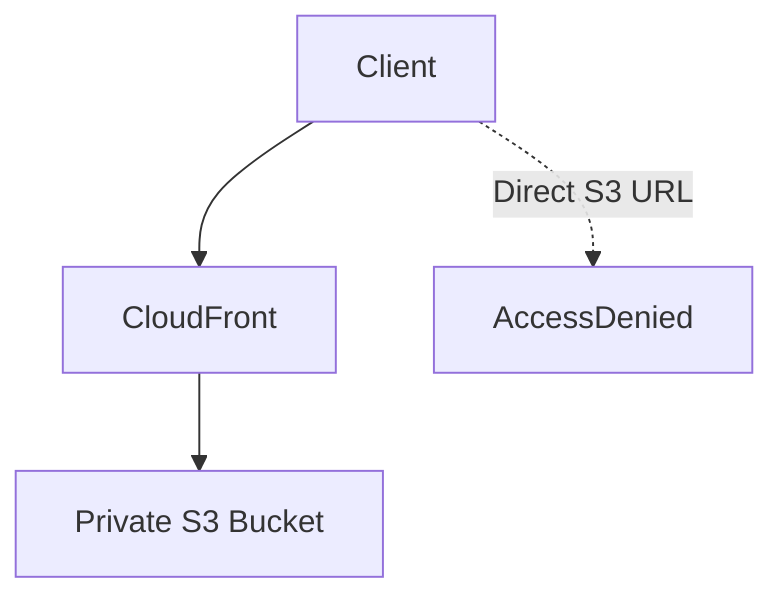

# 11 - CloudFront S3 OAC

Basic CloudFront distribution serving content from a private S3 bucket using Origin Access Control (OAC), Terraform, and AWS.

This is a learning-in-public lab. It is meant to show how CloudFront, S3, Origin Access Control, bucket policies, and SigV4 work together, not to present a production-ready static website.

## Architecture

### Request flow



### Access flow



## Resources

- Private S3 bucket
- S3 Public Access Block
- HTTPS-only bucket policy
- Bucket policy allowing CloudFront to read objects
- Origin Access Control (OAC)
- CloudFront distribution
- Static `index.html`

The page serves:

```text
CloudFront works!
```

## S3 security

The bucket is configured to remain private.

Public access is blocked through:

- Public Access Block
- No public ACLs
- No public bucket policy

The bucket policy allows only the CloudFront distribution to perform:

```text
s3:GetObject
```

using:

```text
cloudfront.amazonaws.com
```

and the distribution ARN.

## CloudFront configuration

The distribution uses:

```text
Origin: S3
Origin Access Control: enabled
Signing protocol: SigV4
Default root object: index.html
Viewer protocol policy: Redirect HTTP to HTTPS
```

## Key concepts

- CloudFront is a global CDN that caches content close to users.
- S3 remains private and cannot be accessed directly.
- Origin Access Control allows CloudFront to securely access private S3 content.
- OAC signs every origin request using SigV4.
- S3 verifies the signature before returning objects.
- Bucket policies decide whether CloudFront is allowed to read the requested object.
- Clients never communicate directly with S3.

## What I learned

- How CloudFront serves content from a private S3 bucket
- Why public S3 access is unnecessary when using OAC
- The purpose of Origin Access Control
- How SigV4 authenticates CloudFront requests to S3
- How bucket policies restrict access to a specific CloudFront distribution
- The difference between accessing content through CloudFront and directly through S3

## Commands

Run from this project directory:

```sh
../../tools/tf.sh init
../../tools/tf.sh fmt
../../tools/tf.sh validate
../../tools/tf.sh plan
../../tools/tf.sh apply
```

Apply without confirmation:

```sh
../../tools/tf.sh apply-auto
```

Destroy the lab:

```sh
../../tools/tf.sh destroy
```

## Useful AWS CLI checks

Describe the CloudFront distribution:

```sh
aws cloudfront get-distribution \
  --id <distribution-id>
```

List S3 buckets:

```sh
aws s3 ls
```

Verify CloudFront:

```sh
curl https://<cloudfront-domain>
```

Expected response:

```text
CloudFront works!
```

Verify direct S3 access:

```sh
curl https://<bucket>.s3.<region>.amazonaws.com/index.html
```

Expected response:

```text
AccessDenied
```

## Verification

The deployment was verified in real AWS.

CloudFront:

```text
https://dzx44jatwcrpr.cloudfront.net
```

Response:

```text
CloudFront works!
```

Direct S3 access:

```text
https://11-cloudfront-s3-oac.s3.us-east-1.amazonaws.com/index.html
```

Response:

```text
AccessDenied
```

This verifies the complete flow:

```text
Client
→ CloudFront
→ Origin Access Control
→ Private S3 Bucket
→ index.html
```

## Real AWS note

This lab was deployed and verified in real AWS because CloudFront support in Floci currently does not fully support Terraform's CloudFront lifecycle.

A production deployment would typically also include:

- Custom domain
- ACM certificate
- Route 53 DNS
- Cache policies tuned for the application
- CloudFront logging
- Versioned static assets
- CI/CD deployment pipeline
