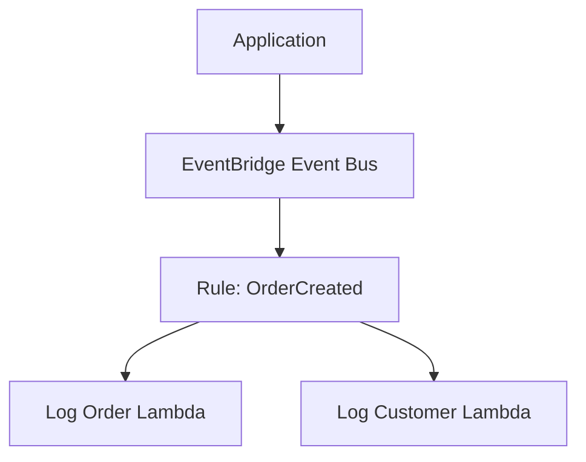

# 12 - AWS EventBridge with Terraform

AWS EventBridge lab built with Terraform for routing one custom event to two Lambda targets.

## Architecture

This diagram shows one EventBridge rule fanning out an `OrderCreated` event to two Lambda functions.



## Resources

- Custom event bus
- EventBridge rule
- Two EventBridge targets
- Lambda execution role
- Two Lambda functions
- Lambda invoke permissions for EventBridge

## Event pattern

```text
source = app.orders
detail-type = OrderCreated
```

Example detail:

```json
{"orderId":"order-123","customerId":"customer-456"}
```

## What I learned

- How EventBridge rules filter on `source` and `detail-type`
- How one event can fan out to multiple consumers
- Why `aws_lambda_permission` is needed even when the rule already points at Lambda
- How this kind of flow stays loosely coupled

## Run

```sh
../../tools/tf.sh init
../../tools/tf.sh validate
../../tools/tf.sh plan
../../tools/tf.sh apply
../../tools/tf.sh destroy
```

## Verify

Publish an event:

```sh
aws events put-events   --entries '[
    {
      "Source":"app.orders",
      "DetailType":"OrderCreated",
      "Detail":"{"orderId":"order-123","customerId":"customer-456"}",
      "EventBusName":"12-eventbridge-bus"
    }
  ]'
```

Expected logs:

```text
Received order: order-123
Received customer: customer-456
```
