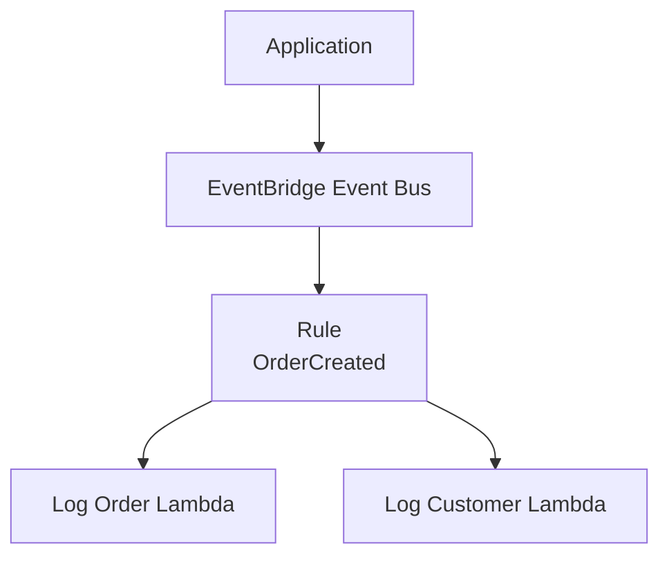
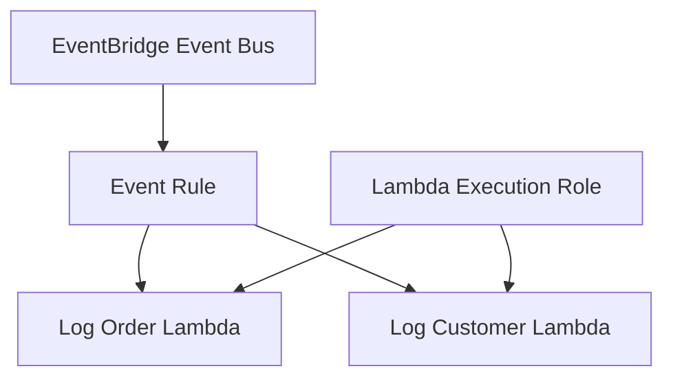

# 12 - EventBridge

Basic Amazon EventBridge event routing using Lambda functions and Terraform with Floci.

This is a learning-in-public lab. It is meant to show how EventBridge routes events to multiple targets, not to present a production-ready event-driven architecture, and Floci behavior can differ from real AWS.

## Architecture

### Event flow



### Resources



## Resources

- EventBridge custom event bus
- EventBridge rule
- Two EventBridge targets
- Lambda execution role
- Lambda execution role attachment (`AWSLambdaBasicExecutionRole`)
- Log Order Lambda
- Log Customer Lambda
- Lambda invoke permissions for EventBridge

## IAM configuration

The Lambda execution role allows both Lambda functions to write logs to CloudWatch.

EventBridge is granted permission to invoke each Lambda function through `aws_lambda_permission`.

## EventBridge configuration

The custom event bus receives application events.

The rule matches:

```text
Source: app.orders
DetailType: OrderCreated
```

When the event matches, EventBridge invokes both Lambda functions.

Example event:

```json
{
  "Source": "app.orders",
  "DetailType": "OrderCreated",
  "Detail": {
    "orderId": "order-123",
    "customerId": "customer-456"
  }
}
```

## Key concepts

- EventBridge is an event router.
- An Event Bus receives events.
- A Rule filters incoming events.
- A Target defines what should happen when a rule matches.
- Multiple targets can receive the same event.
- Producers do not know which consumers receive an event.
- EventBridge enables loosely coupled architectures.

## What I learned

- How to create a custom EventBridge event bus.
- How EventBridge rules filter events using `source` and `detail-type`.
- How one event can trigger multiple Lambda functions.
- How EventBridge targets connect rules to Lambda.
- Why `aws_lambda_permission` is required.
- The difference between event producers and event consumers.

## Commands

Run from this project directory:

```sh
../../tools/tf.sh init
../../tools/tf.sh fmt
../../tools/tf.sh validate
../../tools/tf.sh plan
../../tools/tf.sh apply
```

Apply without confirmation:

```sh
../../tools/tf.sh apply-auto
```

Destroy the lab:

```sh
../../tools/tf.sh destroy
```

## Useful AWS CLI checks

Publish an event:

```sh
aws events put-events \
  --entries '[
    {
      "Source":"app.orders",
      "DetailType":"OrderCreated",
      "Detail":"{\"orderId\":\"order-123\",\"customerId\":\"customer-456\"}",
      "EventBusName":"12-eventbridge-bus"
    }
  ]'
```

List EventBridge buses:

```sh
aws events list-event-buses
```

List EventBridge rules:

```sh
aws events list-rules \
  --event-bus-name 12-eventbridge-bus
```

View Lambda logs:

```sh
aws logs get-log-events \
  --log-group-name /aws/lambda/12-eventbridge-log-order \
  --log-stream-name '<log-stream>'
```

## Local Floci verification

Published event:

```text
Source:
app.orders

DetailType:
OrderCreated
```

Order Lambda:

```text
Received order: order-123
```

Customer Lambda:

```text
Received customer: customer-456
```

This verifies the complete flow:

```text
Producer
→ EventBridge Event Bus
→ Rule
→ Log Order Lambda

           and

→ Log Customer Lambda
```

## Real AWS note

This lab uses two simple Lambda functions to demonstrate the fundamentals of Amazon EventBridge.

In a more typical production design:

- Events would come from an application instead of the AWS CLI.
- Different rules would route different event types to different consumers.
- Targets could be Lambda, SQS, SNS, Step Functions, or ECS.
- Failed deliveries would need retries, monitoring, and error handling.
