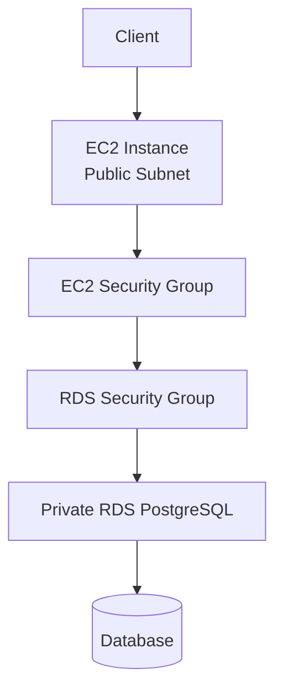
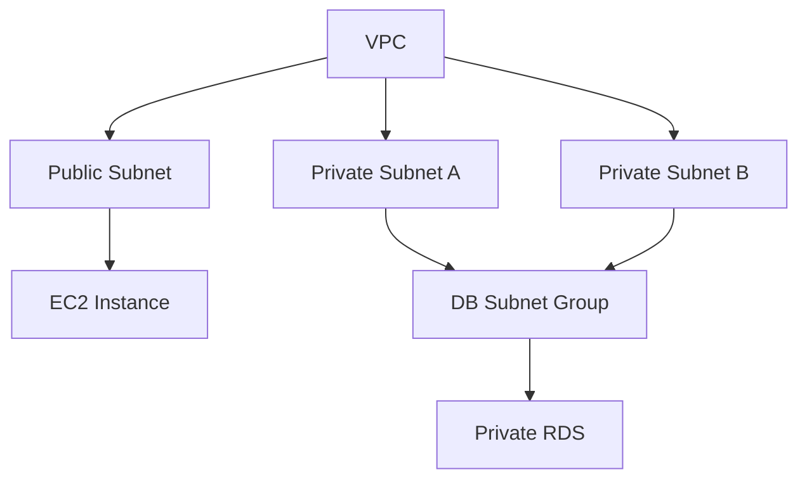

# 13 - Private RDS

Basic private Amazon RDS PostgreSQL deployment inside a VPC using Terraform and AWS.

This is a learning-in-public lab. It is meant to show how a private database is deployed inside a VPC, how EC2 connects to it over private networking, and how Security Groups control database access, not to present a production-ready database architecture.

## Architecture

### Network flow



### Resources



## Resources

- VPC
- Internet Gateway
- Public subnet
- Two private subnets
- Public route table
- Private route table
- EC2 security group
- RDS security group
- DB subnet group
- Private PostgreSQL RDS instance
- EC2 instance
- User data script verifying database connectivity

## Network configuration

The EC2 instance is deployed in a public subnet.

The RDS instance is deployed inside a DB subnet group containing two private subnets.

The database is configured as:

```text
Publicly accessible: false
```

The EC2 instance connects to the database using the private RDS endpoint.

## Security configuration

The EC2 security group allows outbound traffic.

The RDS security group allows PostgreSQL connections only from the EC2 security group:

```text
TCP 5432
Source: EC2 Security Group
```

No direct public access to the database is allowed.

## Key concepts

- RDS should normally be deployed in private subnets.
- A DB subnet group defines which subnets RDS may use.
- RDS endpoints are private when public access is disabled.
- Security Groups control which resources may connect to the database.
- EC2 communicates with RDS over the VPC's private network.
- Internet Gateway provides internet access only for resources in public subnets.

## What I learned

- How to deploy a private PostgreSQL RDS instance.
- Why RDS requires a DB subnet group.
- How public and private subnets work together.
- How Security Groups restrict database access.
- How an EC2 instance connects to a private RDS endpoint.
- How to verify connectivity by executing a SQL query from EC2.

## Commands

Run from this project directory:

```sh
../../tools/tf.sh init
../../tools/tf.sh fmt
../../tools/tf.sh validate
../../tools/tf.sh plan
../../tools/tf.sh apply
```

Apply without confirmation:

```sh
../../tools/tf.sh apply-auto
```

Destroy the lab:

```sh
../../tools/tf.sh destroy
```

## Useful AWS CLI checks

Describe the RDS instance:

```sh
aws rds describe-db-instances \
  --db-instance-identifier db-13-rds-private
```

Describe the DB subnet group:

```sh
aws rds describe-db-subnet-groups
```

List EC2 instances:

```sh
aws ec2 describe-instances
```

## Verification

The deployment was verified in AWS.

RDS:

```text
Status: available
Publicly accessible: false
```

Connectivity from EC2:

```text
SELECT 1;
```

Response:

```text
?column?
----------
1
(1 row)
```

This verifies the complete flow:

```text
EC2
→ Security Group
→ Private RDS Endpoint
→ PostgreSQL
→ SELECT 1
```

## Real AWS note

A production deployment would typically also include:

- Multi-AZ deployment
- Automated backups
- Parameter groups
- Option groups
- Secrets Manager for database credentials
- IAM database authentication
- Monitoring with CloudWatch
- Read replicas
- Database encryption with KMS
