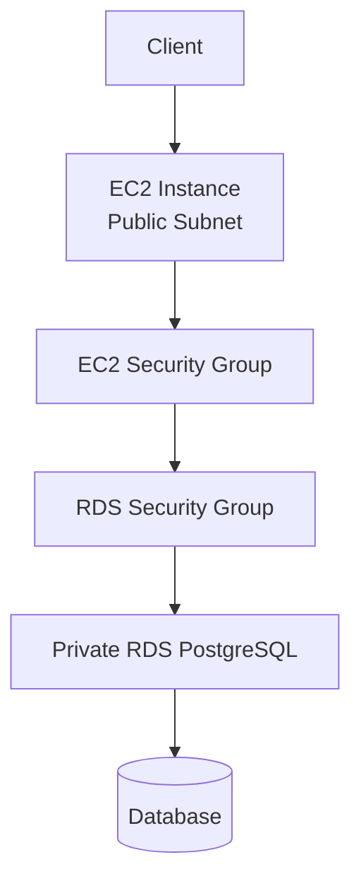

# 13 - AWS RDS PostgreSQL in a Private VPC with Terraform

AWS RDS PostgreSQL lab built with Terraform for a private database reached from an EC2 instance inside the same VPC.

## Architecture

This diagram shows the EC2 client, the security-group hop, and the private RDS endpoint.



## Resources

- VPC
- Internet Gateway
- Public subnet
- Two private subnets
- Public and private route tables
- EC2 security group
- RDS security group
- DB subnet group
- Private PostgreSQL RDS instance
- EC2 instance running a connectivity check

## Notes

- The RDS instance is `publicly_accessible = false`.
- The EC2 instance reaches it through the private endpoint.
- The RDS security group allows `tcp/5432` only from the EC2 security group.

## What I learned

- Why RDS needs a DB subnet group
- How public and private subnets work together in one lab
- How security-group-to-security-group rules keep the database private
- How to prove connectivity with a simple `SELECT 1`

## Run

```sh
../../tools/tf.sh init
../../tools/tf.sh validate
../../tools/tf.sh plan
../../tools/tf.sh apply
../../tools/tf.sh destroy
```

## Verify

Key checks:

```sh
aws rds describe-db-instances   --db-instance-identifier db-13-rds-private
```

Expected DB state:

```text
Status: available
Publicly accessible: false
```

Connectivity proof from EC2:

```text
SELECT 1;
1
```
