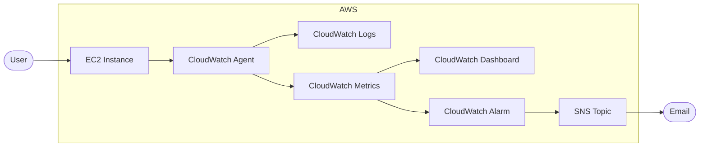

# 14 - Observability

This lab creates a complete observability pipeline for an EC2 instance using CloudWatch, SNS, and Terraform.

This lab was verified in a real AWS account. It was not positioned as a Floci-validated lab.

The Terraform code was written manually to make sure I understand how EC2 monitoring, CloudWatch Agent, custom metrics, CloudWatch dashboards, alarms, IAM roles, log groups, and SNS notifications connect to each other.

## Resources

- VPC
- Public subnet
- Internet Gateway
- Route table
- Security group
- EC2 instance (Amazon Linux 2023)
- IAM role
- IAM instance profile
- CloudWatch Agent
- CloudWatch Log Groups
- CloudWatch Dashboard
- CloudWatch Metric Alarm
- SNS Topic
- SNS Email Subscription

## Architecture

## Flow

1. Terraform deploys the networking, IAM resources, EC2 instance, CloudWatch resources, and SNS topic.
2. EC2 launches and executes the user data script, which installs the web application, systemd service, and CloudWatch Agent.
3. The CloudWatch Agent continuously publishes application logs and custom system metrics.
4. CloudWatch stores logs and metrics.
5. The dashboard visualizes memory and disk utilization.
6. A CloudWatch alarm continuously evaluates memory usage.
7. When the configured threshold is exceeded, CloudWatch publishes a notification to SNS.
8. SNS sends an email notification to the subscribed address.

## Key Concepts

### CloudWatch Agent

Collects operating system metrics and log files from the EC2 instance that are not included in the default EC2 monitoring.

### CloudWatch Logs

Centralized log storage used for application logs and user data execution logs.

### CloudWatch Metrics

Stores custom metrics published by the CloudWatch Agent.

Examples:

- `mem_used_percent`
- `disk_used_percent`

### CloudWatch Dashboard

Provides a centralized view of system health by visualizing memory usage, disk usage, and alarm status.

### CloudWatch Alarm

Continuously evaluates metric values and changes state when a configured threshold is crossed.

### Amazon SNS

Delivers notifications when the alarm enters the **ALARM** state.

## Verification

Verified in real AWS:

- EC2 instance successfully deployed
- Application reachable over HTTP
- CloudWatch Agent running
- Application logs available in CloudWatch Logs
- Custom memory metrics published
- Custom disk metrics published
- Dashboard displays live memory and disk utilization
- CloudWatch Alarm evaluates memory utilization correctly
- SNS email subscription confirmed
- End-to-end notification flow successfully validated

## Lessons Learned

- CloudWatch custom metrics must exactly match the published metric name.
- Disk metrics require all published dimensions (`InstanceId`, `device`, `fstype`, and `path`) when creating dashboard widgets.
- CloudWatch dashboards may initially appear empty until metrics begin arriving.
- Using AWS Systems Manager Parameter Store is a better approach than hardcoding AMI IDs when deploying Amazon Linux 2023.
- Replacing an EC2 instance creates a new CloudWatch log stream while the existing log group and previous streams remain available.

## Outcome

Successfully built and validated a complete observability solution in real AWS using Terraform, including custom metrics, centralized logging, dashboards, alarms, and email notifications.
