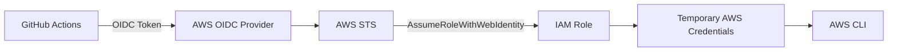

# 15 - GitHub Actions OIDC to AWS with Terraform

GitHub Actions and AWS IAM lab built with Terraform for OIDC-based authentication without long-lived access keys.

## Architecture

This diagram shows GitHub Actions exchanging an OIDC token for temporary AWS credentials through STS.



## Resources

- IAM OIDC provider
- IAM role for GitHub Actions
- Trust policy restricted to this repo and branch
- `AmazonEC2ContainerRegistryPowerUser` policy attachment
- GitHub Actions workflow

## Trust policy

```text
aud = sts.amazonaws.com
sub = repo:mohammedhammoud/aws-terraform-labs:ref:refs/heads/master
```

Only workflows from this repo and branch can assume the role.

## What I learned

- OIDC removes the need for long-lived AWS keys in GitHub secrets
- The trust policy is where repo and branch restrictions really happen
- STS returns short-lived credentials only for the workflow session
- The workflow proof is just `aws sts get-caller-identity`

## Verify

Workflow file:

```text
.github/workflows/15-github-oidc.yml
```

Key step:

```yaml
- name: Verify assumed identity
  run: aws sts get-caller-identity
```

Expected shape:

```text
arn:aws:sts::<account-id>:assumed-role/15-github-oidc-oidc/github-oidc-lab
```

Example run:

https://github.com/mohammedhammoud/aws-terraform-labs/actions/runs/29616651314

## Commands

```sh
terraform init
terraform apply
terraform output github_actions_role_arn
terraform destroy
```
