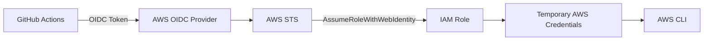

# 15 - GitHub OIDC

This lab configures GitHub Actions to authenticate to AWS using OpenID Connect (OIDC) instead of long-lived AWS access keys.

Terraform creates an IAM OpenID Connect provider and an IAM role with a trust policy that only allows GitHub Actions from this repository and branch to assume the role. A GitHub Actions workflow then requests temporary AWS credentials and verifies the assumed identity using AWS STS.

> [!NOTE]
> Unlike the previous labs in this repository, this lab was deployed and verified against a real AWS account rather than Floci because GitHub OIDC requires AWS IAM and STS.

## Architecture



## Resources

- IAM OpenID Connect provider
- IAM role for GitHub Actions
- IAM trust policy restricted to a specific repository and branch
- AmazonEC2ContainerRegistryPowerUser policy attachment
- GitHub Actions workflow

## Authentication Flow

1. A GitHub Actions workflow is started manually.
2. GitHub generates a signed OIDC token.
3. The `configure-aws-credentials` action sends the token to AWS STS.
4. AWS validates the token using the configured OIDC provider.
5. The IAM trust policy verifies:
   - Audience (`aud`) is `sts.amazonaws.com`
   - Repository matches `mohammedhammoud/cloud-lab`
   - Branch matches `master`
6. AWS STS exchanges the token for temporary AWS credentials.
7. The workflow verifies the assumed identity using `aws sts get-caller-identity`.

## Trust Policy

Only GitHub Actions runs from the configured repository and branch may assume the role.

```text
aud = sts.amazonaws.com
sub = repo:mohammedhammoud/cloud-lab:ref:refs/heads/master
```

This prevents workflows from other repositories or branches from assuming the IAM role.

## GitHub Actions Workflow

The workflow is located at:

```text
.github/workflows/15-github-oidc.yml
```

It is triggered manually:

```yaml
on:
  workflow_dispatch:
```

Required permissions:

```yaml
permissions:
  id-token: write
  contents: read
```

`id-token: write` allows GitHub Actions to request an OpenID Connect token.

## Verification

The workflow configures AWS credentials using the IAM role and verifies the identity:

```yaml
- name: Configure AWS credentials
  uses: aws-actions/configure-aws-credentials@v4
  with:
    role-to-assume: ${{ env.AWS_ROLE_ARN }}
    aws-region: ${{ env.AWS_REGION }}

- name: Verify assumed identity
  run: aws sts get-caller-identity
```

A successful run returns an assumed role similar to:

```text
arn:aws:sts::<account-id>:assumed-role/15-github-oidc-oidc/github-oidc-lab
```

A successful GitHub Actions run against a real AWS account can be viewed here:

https://github.com/mohammedhammoud/cloud-lab/actions/runs/29616651314

## Key Concepts

### OpenID Connect (OIDC)

OIDC allows GitHub Actions to authenticate directly with AWS without storing permanent AWS credentials.

GitHub issues a signed identity token which AWS validates before allowing the IAM role to be assumed.

### IAM Trust Policy

The trust policy defines **who may assume the role**.

In this lab it restricts access to:

- GitHub Actions
- This repository
- The `master` branch

### IAM Permission Policy

The attached IAM policy defines **what the role is allowed to do after it has been assumed**.

For this lab the role is granted:

```text
AmazonEC2ContainerRegistryPowerUser
```

In production environments this would typically be replaced with a custom least-privilege policy.

### AWS Security Token Service (STS)

AWS STS validates the GitHub OIDC token and exchanges it for temporary AWS credentials.

Those credentials only exist for the lifetime of the workflow.

### Temporary Credentials

After the IAM role has been assumed, AWS returns temporary credentials consisting of:

- Access key ID
- Secret access key
- Session token

These credentials are automatically injected into the GitHub Actions runner and expire after the session ends.

## Why Use OIDC?

Compared to storing AWS access keys as GitHub Secrets, OIDC provides several advantages:

- No long-lived AWS access keys
- Short-lived temporary credentials
- Repository and branch restrictions
- Centralized permission management in AWS IAM
- Reduced credential management overhead

## Commands

Initialize Terraform:

```bash
terraform init
```

Deploy the infrastructure:

```bash
terraform apply
```

Print the IAM role ARN:

```bash
terraform output github_actions_role_arn
```

Destroy the infrastructure:

```bash
terraform destroy
```
