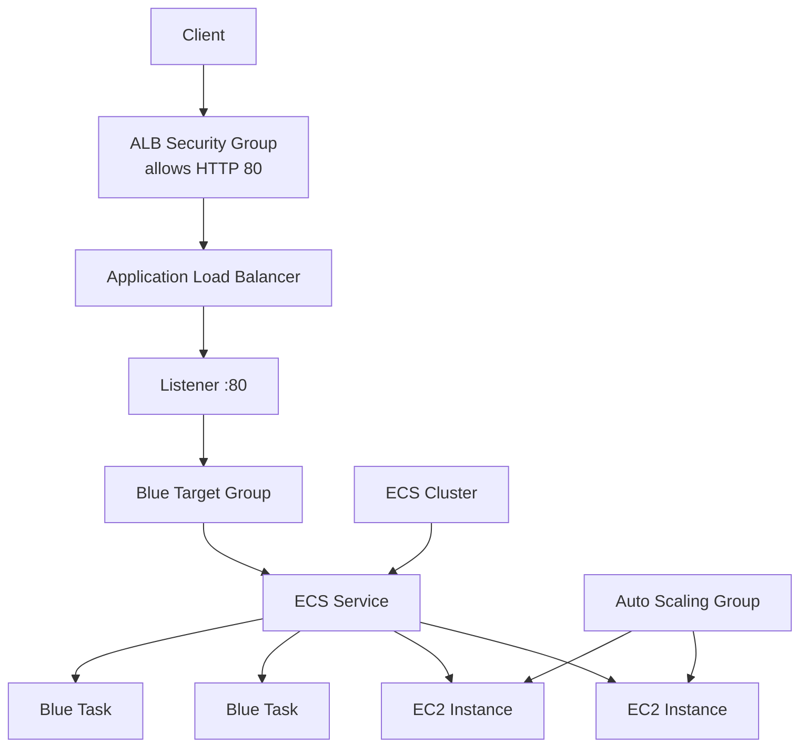
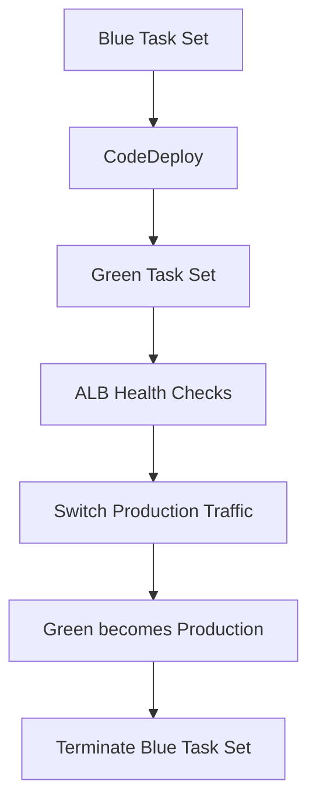

# 16 - ECS Blue/Green

Basic ECS Blue/Green deployment using EC2, Application Load Balancer, CodeDeploy, Terraform, and Floci.

This lab demonstrates how ECS, CodeDeploy, ALB target groups, and traffic switching work together during a Blue/Green deployment.

## Architecture

### Request flow



### Blue/Green deployment



## Resources

- VPC
- Two public subnets
- Internet Gateway
- Public route table
- Application Load Balancer
- HTTP listener
- Blue target group
- Green target group
- ALB security group
- ECS task security group
- ECS Cluster
- ECS Task Definition
- ECS Service
- Launch Template
- Auto Scaling Group
- ECS task execution role
- ECS container instance role
- CodeDeploy service role
- CodeDeploy application
- CodeDeploy deployment group

The application serves:

```text
Welcome to nginx!
```

## ECS configuration

The ECS Service uses:

```text
Launch type: EC2
Deployment controller: CODE_DEPLOY
Network mode: awsvpc
Desired tasks: 2
```

Because the tasks use `awsvpc`, every task receives its own network interface.

The target groups therefore use:

```hcl
target_type = "ip"
```

instead of registering EC2 instances.

## Blue/Green deployment

The deployment group is configured with:

```text
Deployment type: BLUE_GREEN
Deployment option: WITH_TRAFFIC_CONTROL
Deployment configuration: CodeDeployDefault.ECSAllAtOnce
```

Deployment flow:

1. CodeDeploy creates a green task set.
2. The green tasks register in the green target group.
3. ALB health checks verify the new tasks.
4. Production traffic switches from the blue target group to the green target group.
5. The old blue task set is removed.

Rollback is enabled if a deployment fails.

## Key concepts

- Blue is the currently running application version.
- Green is the new application version.
- CodeDeploy manages Blue/Green deployments for ECS.
- The ALB listener determines which target group receives production traffic.
- Two target groups allow both versions to exist simultaneously.
- ALB health checks protect the traffic switch.
- `awsvpc` networking requires IP target groups.
- The Auto Scaling Group provides EC2 capacity for ECS.

## What I learned

- How ECS Blue/Green deployments differ from rolling deployments.
- Why ECS uses the CodeDeploy deployment controller.
- Why Blue/Green deployments require two target groups.
- How CodeDeploy creates and promotes task sets.
- How the ALB listener switches production traffic.
- Why health checks are required before traffic is moved.
- The difference between ECS task execution, ECS container instance, and CodeDeploy IAM roles.

## Commands

Run from this project directory:

```sh
../../tools/tf.sh init
../../tools/tf.sh fmt
../../tools/tf.sh validate
../../tools/tf.sh plan
../../tools/tf.sh apply
```

Apply without confirmation:

```sh
../../tools/tf.sh apply-auto
```

Destroy the lab:

```sh
../../tools/tf.sh destroy
```

## Useful AWS CLI

Describe the ECS service:

```sh
aws ecs describe-services \
  --cluster 16-ecs-blue-green-cluster \
  --services 16-ecs-blue-green-service
```

Check target health:

```sh
aws elbv2 describe-target-health \
  --target-group-arn <blue-target-group-arn>
```

Describe the deployment group:

```sh
aws deploy get-deployment-group \
  --application-name 16-ecs-blue-green-app \
  --deployment-group-name 16-ecs-blue-green-deployment-group
```

List task definitions:

```sh
aws ecs list-task-definitions \
  --family-prefix 16-ecs-blue-green-task
```

## Verification

The infrastructure was successfully deployed in Floci.

Verified:

- ECS Cluster created
- ECS Service running two tasks
- Two EC2 container instances registered
- Blue target group reporting healthy targets
- ALB listener forwarding to the blue target group
- CodeDeploy application created
- CodeDeploy deployment group created
- nginx responding successfully inside the running ECS task container

Direct container verification:

```sh
docker exec \
  floci-ecs-da59987e0bf3459c964c7f689ec5ab25-web \
  wget -qO- http://127.0.0.1:80
```

Expected response:

```text
Welcome to nginx!
```

The generated ALB DNS name resolves locally, but the ALB listener is not exposed to the Docker host when Floci is started using `floci start`.

The deployment was therefore verified through ECS service state, target health, listener configuration, and direct container access.

## Floci note

Floci successfully models the ECS, ALB, Auto Scaling, IAM, and CodeDeploy resources used in this lab.

Some AWS-managed IAM policies are not currently available in Floci, so equivalent custom IAM policies were used instead.

## Real AWS note

A production deployment would typically also include:

- Private subnets
- HTTPS with ACM
- Amazon ECR
- CloudWatch monitoring
- Capacity Providers
- Canary or linear traffic shifting
- CI/CD pipeline
