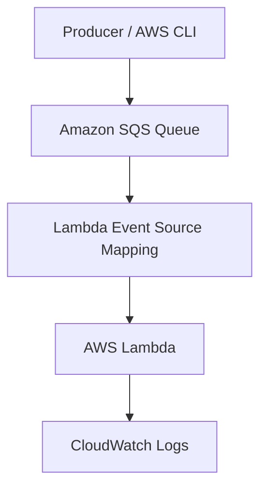
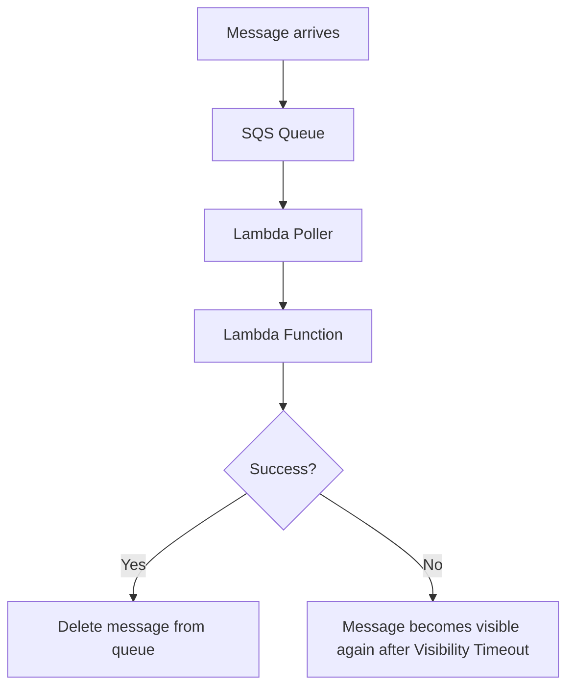

# 17 - SQS Basics

Basic Amazon SQS queue with AWS Lambda using Terraform and Floci.

This lab demonstrates how Amazon SQS asynchronously delivers messages to a Lambda function using an Event Source Mapping.

## Architecture

### Message flow



### Processing flow



## Resources

- Amazon SQS queue
- AWS Lambda function
- Lambda Event Source Mapping
- Lambda execution IAM role
- CloudWatch Logs

The Lambda function logs every received message.

## Configuration

### SQS Queue

The queue is configured with:

```text
Visibility timeout: 60 seconds
```

The visibility timeout is six times the Lambda timeout, following AWS recommendations.

### Lambda

The Lambda function uses:

```text
Runtime: Node.js 20
Timeout: 10 seconds
Batch size: 1
```

The Event Source Mapping continuously polls the queue and invokes the Lambda whenever messages are available.

## Key concepts

- Amazon SQS is a fully managed message queue.
- Producers send messages without communicating directly with consumers.
- Lambda polls the queue through an Event Source Mapping.
- Messages are delivered inside the `event.Records` array.
- Successful processing automatically removes the message from the queue.
- Failed processing makes the message visible again after the visibility timeout.

## What I learned

- How to create an Amazon SQS queue with Terraform.
- How Lambda integrates with SQS using an Event Source Mapping.
- Why Lambda requires both logging and SQS execution permissions.
- How visibility timeout protects messages while they are being processed.
- How SQS delivers messages asynchronously.
- How to inspect Lambda execution through CloudWatch Logs.

## Commands

Run from this project directory:

```sh
../../tools/tf.sh init
../../tools/tf.sh fmt
../../tools/tf.sh validate
../../tools/tf.sh plan
../../tools/tf.sh apply
```

Apply without confirmation:

```sh
../../tools/tf.sh apply-auto
```

Destroy the lab:

```sh
../../tools/tf.sh destroy
```

## Verification

Send a message to the queue:

```sh
aws sqs send-message \
  --queue-url http://localhost:4566/000000000000/17-sqs-basics-lab-queue \
  --message-body "Hello from SQS"
```

Retrieve the latest Lambda logs:

```sh
LOG_STREAM=$(aws logs describe-log-streams \
  --log-group-name /aws/lambda/17-sqs-basics-process-message \
  --order-by LastEventTime \
  --descending \
  --max-items 1 \
  --query 'logStreams[0].logStreamName' \
  --output text)

aws logs get-log-events \
  --log-group-name /aws/lambda/17-sqs-basics-process-message \
  --log-stream-name "$LOG_STREAM"
```

Example output:

```text
Processing message <message-id>: Hello from SQS
```

Verify that the queue is empty after successful processing:

```sh
aws sqs get-queue-attributes \
  --queue-url http://localhost:4566/000000000000/17-sqs-basics-lab-queue \
  --attribute-names \
    ApproximateNumberOfMessages \
    ApproximateNumberOfMessagesNotVisible
```

Expected result:

```text
ApproximateNumberOfMessages: 0
ApproximateNumberOfMessagesNotVisible: 0
```

## Floci note

This lab was successfully tested using Floci.

Verified:

- SQS queue created
- Lambda function deployed
- Event Source Mapping connected
- Message delivered to Lambda
- Lambda processed the message successfully
- CloudWatch Logs captured the invocation
- Message removed from the queue after successful processing
