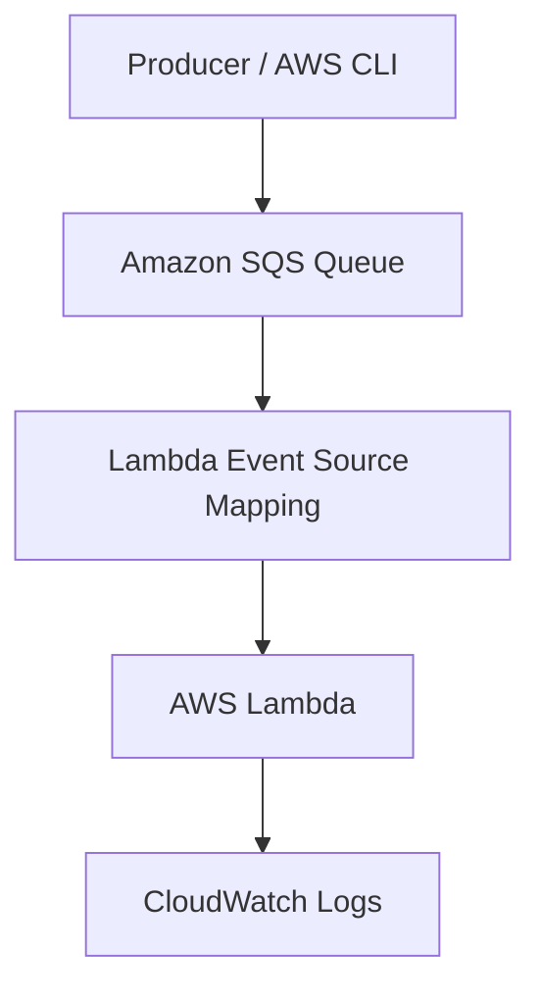

# 17 - AWS SQS and Lambda with Terraform

AWS SQS and Lambda lab built with Terraform for asynchronous message processing through an event source mapping.

## Architecture

This diagram shows SQS feeding messages into Lambda through the event source mapping.



## Resources

- Amazon SQS queue
- AWS Lambda function
- Lambda Event Source Mapping
- Lambda execution IAM role
- CloudWatch Logs

## Notes

- Queue visibility timeout: `60s`
- Lambda timeout: `10s`
- Batch size: `1`

## What I learned

- How Lambda polls SQS through the event source mapping
- Why the visibility timeout should be longer than the Lambda timeout
- Why Lambda needs both logging permissions and SQS execution permissions
- How to prove message handling with one log line and an empty queue

## Run

```sh
../../tools/tf.sh init
../../tools/tf.sh validate
../../tools/tf.sh plan
../../tools/tf.sh apply
../../tools/tf.sh destroy
```

## Verify

Send a message:

```sh
aws sqs send-message   --queue-url http://localhost:4566/000000000000/17-sqs-basics-lab-queue   --message-body "Hello from SQS"
```

Expected log line:

```text
Processing message <message-id>: Hello from SQS
```

Queue should end up empty:

```text
ApproximateNumberOfMessages: 0
ApproximateNumberOfMessagesNotVisible: 0
```
